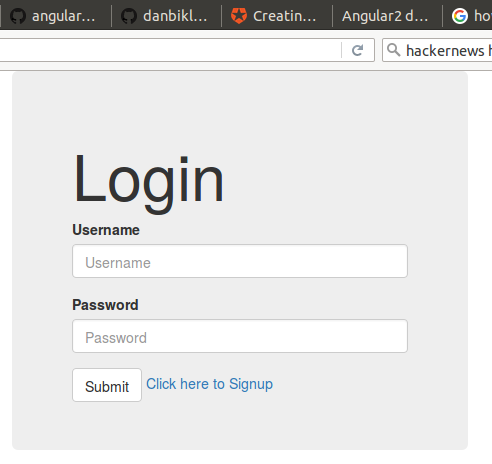

Hello World.

I built this repo after I studied this page:

https://github.com/auth0/angular2-authentication-sample/blob/master/Readme.md

To get started you should get a laptop which runs MacOS/X or Ubunutu 14.04.3.

I got a laptop which runs Ubuntu.

Then I ran some shell commands:
```bash
cd ~
git clone https://github.com/danbikle/ang2auth0
cd ~/ang2auth0/
ls -l
cd ~/ang2auth0/nodejs-jwt-authentication-sample/
npm set progress=false
npm install -s
PORT=3001 node server.js
```

Those shell commands worked well on my laptop so I opened another shell and ran these shell commands:
```bash
cd ~/ang2auth0/angular2-authentication-sample/
npm install -s
npm start
```

That also worked well for me so I opened another shell command and ran this shell command:
```bash
curl localhost:3000
```

I saw this
```html
<!DOCTYPE html>
<html lang="">
<head>
  <title>Angular2 demo by @Auth0</title>

  <meta charset="utf-8">
  <meta http-equiv="X-UA-Compatible" content="IE=edge">
  <meta name="description" content="">
  <meta name="viewport" content="width=device-width, initial-scale=1">

  <base href="/">
  <!-- styles -->
  <link rel="stylesheet" type="text/css" href="/node_modules/bootstrap/dist/css/bootstrap.css">
  <!-- Util -->
  <script type="text/javascript" src="/node_modules/jwt-decode/build/jwt-decode.js"></script>
</head>
<body>

  <auth-app>
    Loading...
  </auth-app>

  <!-- Commmon files to be cached -->
  <script src="/build/common.js"></script>
  <!-- Angular2 files -->
  <script src="/build/vendor.js"></script>
  <!-- App script -->
  <script src="/build/app.js"></script></body>
</html>
```

Next, I used my browser to GET localhost:3000.


