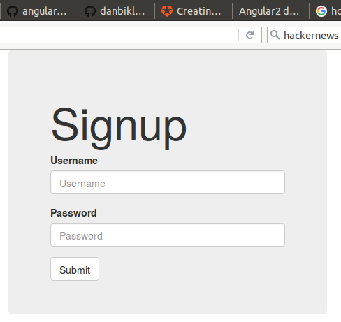
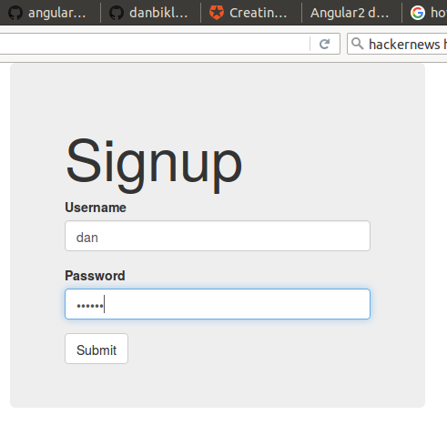
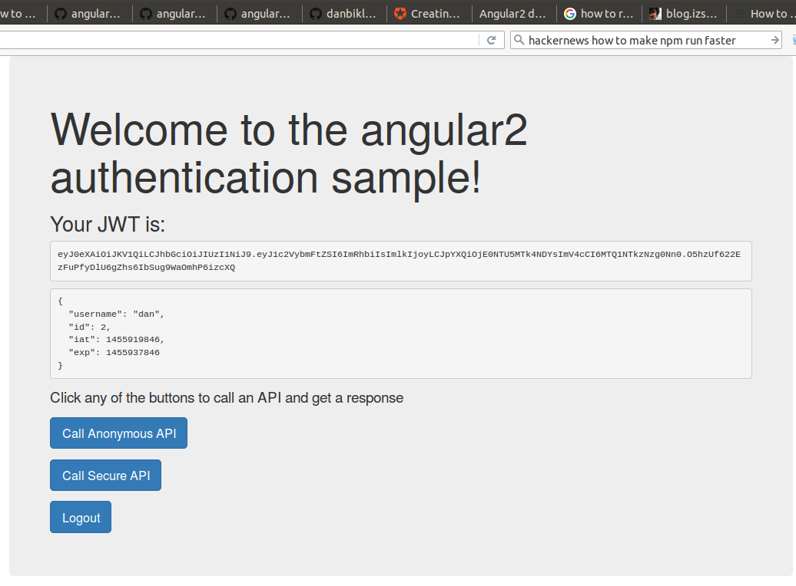

Hello World.

I built this repo after I studied this page:

https://github.com/auth0/angular2-authentication-sample/blob/master/Readme.md

To get started you should get a laptop which runs MacOS/X or Ubunutu 14.04.3.

I got a laptop which runs Ubuntu.

I prefer to use Ubuntu 14.04 because it runs on both my laptop and on Amazon.

I start by installing Ubuntu 14.04 on my laptop.

The most recent version of Ubuntu which I like is at this URL:

http://releases.ubuntu.com/14.04.3/ubuntu-14.04.3-desktop-amd64.iso

The three general paths to install Ubuntu on a laptop are listed below:

- Remove Windows and install Ubuntu
- Ignore Windows and install Ubuntu on USB drive
- Install VirtualBox on Mac or Windows, Install Ubuntu inside VirtualBox

My favorite path is path2: Ignore Windows and install Ubuntu on USB drive.

Path2 works well with a new laptop should I want to maintain the warranty.

If you are new to the world of Ubuntu laptops I suggest you buy a cheap windows laptop from Walmart and run some experiments.

E-me if you need help: bikle101@gmail.com

So, after I installed Ubuntu on my laptop, I ran some shell commands:
```bash
sudo apt-get update
sudo apt-get upgrade

sudo apt-get install autoconf bison build-essential libssl-dev libyaml-dev \
libreadline6-dev zlib1g-dev libncurses5-dev libffi-dev libgdbm3 sqlite3    \
libgdbm-dev libsqlite3-dev gitk emacs wget curl openssh-server aptitude

sudo apt-get update
sudo apt-get upgrade
```

Next, I downloaded and installed Node.js:
```bash
cd ~
wget https://nodejs.org/dist/v5.6.0/node-v5.6.0-linux-x64.tar.gz
rm -rf  node
tar zxf node-v5.6.0-linux-x64.tar.gz
mv      node-v5.6.0-linux-x64 node
```

Then I ran some shell commands:
```bash
cd ~
git clone https://github.com/danbikle/ang2auth0
cd ~/ang2auth0/
ls -l
cd ~/ang2auth0/nodejs-jwt-authentication-sample/
npm set progress=false
npm install -s
PORT=3001 node server.js
```

Those shell commands worked well on my laptop so I opened another shell and ran these shell commands:
```bash
cd ~/ang2auth0/angular2-authentication-sample/
npm install -s
npm start
```

That also worked well for me so I opened another shell command and ran this shell command:
```bash
curl localhost:3000
```

I saw this
```html
<!DOCTYPE html>
<html lang="">
<head>
  <title>Angular2 demo by @Auth0</title>

  <meta charset="utf-8">
  <meta http-equiv="X-UA-Compatible" content="IE=edge">
  <meta name="description" content="">
  <meta name="viewport" content="width=device-width, initial-scale=1">

  <base href="/">
  <!-- styles -->
  <link rel="stylesheet" type="text/css" href="/node_modules/bootstrap/dist/css/bootstrap.css">
  <!-- Util -->
  <script type="text/javascript" src="/node_modules/jwt-decode/build/jwt-decode.js"></script>
</head>
<body>

  <auth-app>
    Loading...
  </auth-app>

  <!-- Commmon files to be cached -->
  <script src="/build/common.js"></script>
  <!-- Angular2 files -->
  <script src="/build/vendor.js"></script>
  <!-- App script -->
  <script src="/build/app.js"></script></body>
</html>
```

Next, I used my browser to GET localhost:3000.


I signed up and it worked:



And this:



I was happy:


